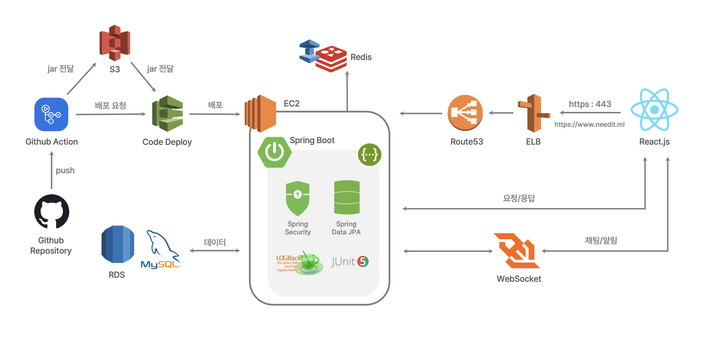

# 🧤Need !t

> **개인과 기관 양방향 기부 매칭 플랫폼** 

<br/>

### Team : Giboony : Back-end

> **[Front-end Repo](https://github.com/prgrms-web-devcourse/Team_Givooni_Needit_FE/blob/develop/README.md)**

|                          **김부희**                          |                          **박권규**                          |                          **이하정**                          |
| :----------------------------------------------------------: | :----------------------------------------------------------: | :----------------------------------------------------------: |
|                 ****                 |                   ****                   |                   ****                   |
|                          담당 기능                           |                          담당 기능                           |                          담당 기능                           |
| ･*프로젝트 일정 관리* ･*CI/CD 구축*<br/>･*로그인* ･*S3 이미지 업로드* <br/>･  *마이페이지,* *기부/기부희망 게시글*  *API 개발* | ･*WebSocket* *설정* <br/>･*알림 /채팅 서비스 관리* <br/>･  *기부거래예약, 활동 게시글*  *API 개발* | ･ *SMTP* *이메일 인증* <br/>･*공공 오픈* *API* *연동* <br/>･  *회원/센터* *,* *관심센터*  *API 개발* |

<br/>

## 서비스 개요

### 주제

```
기관에서 직접 기부를 받고싶은 물품 및 재능을 업로드하고 일반 회원은 GPS를 기반으로 자신의 위치 주변의 기관과 기관에서 작성한 게시물을 
조회할 수 있으며, 일반 회원 역시 자신이 가진 물품과 재능을 업로드하여 기부를 희망하는 기관을 찾을 수 있도록 하는 양방향 기부 플랫폼
```

### 개발환경

- **IDE** : IntelliJ IDEA Ultimate
- **Language** : Java 11
- **Framework** : SpringBoot 2.5.6
- **Build Tool** : Gradle 7.2
- **Database** : MySQL 8.0.23

### 기술 스택 & 협업 툴


<br/>

## Architecture



<br/>

## Feature

> **주요기능 흐름도**


#### [Feature Detail](https://www.notion.so/backend-devcourse/5e14736b817c42e6b271286e63867e44)

<br/>

## DB ERD


<br/>

#### 우리의 컨벤션


